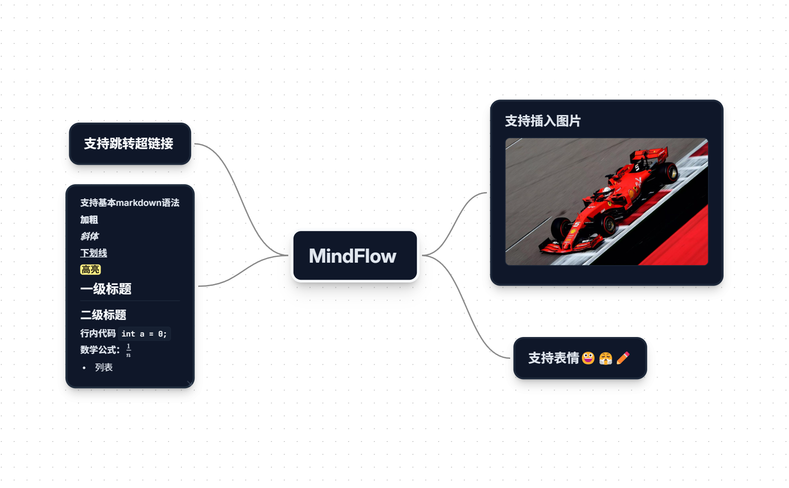
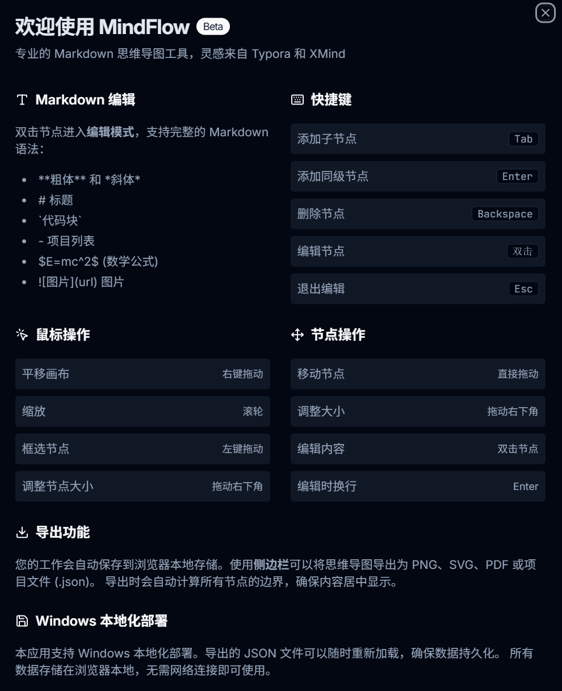
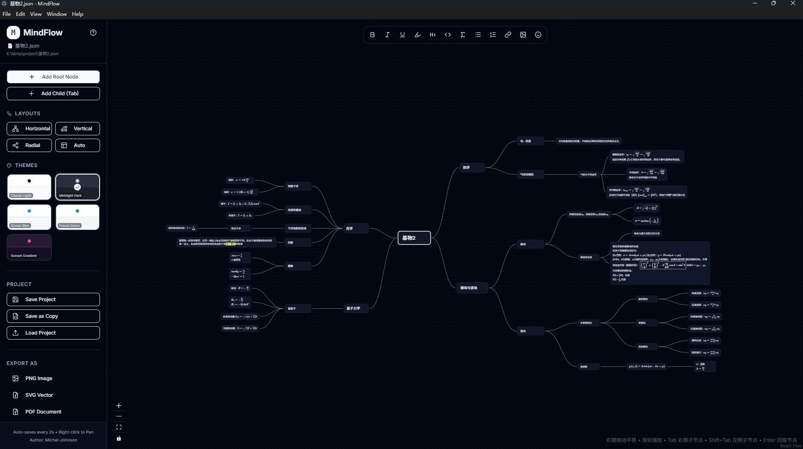
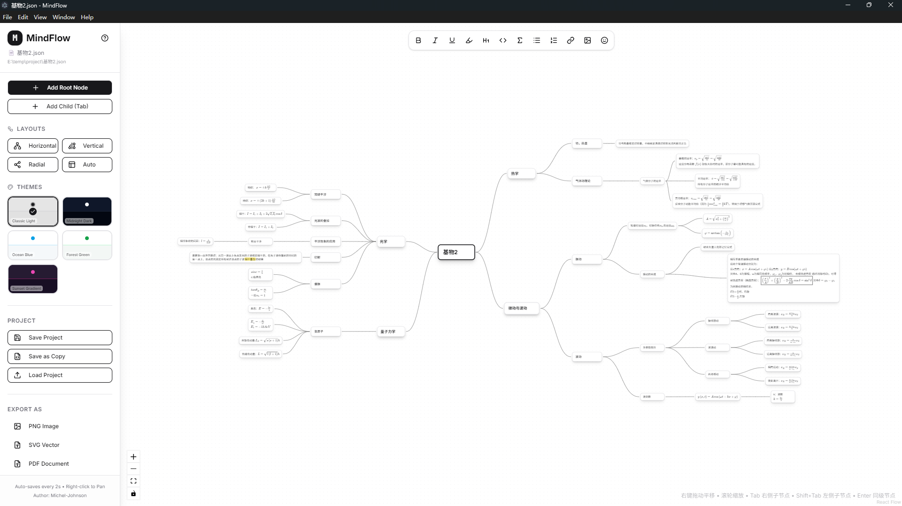
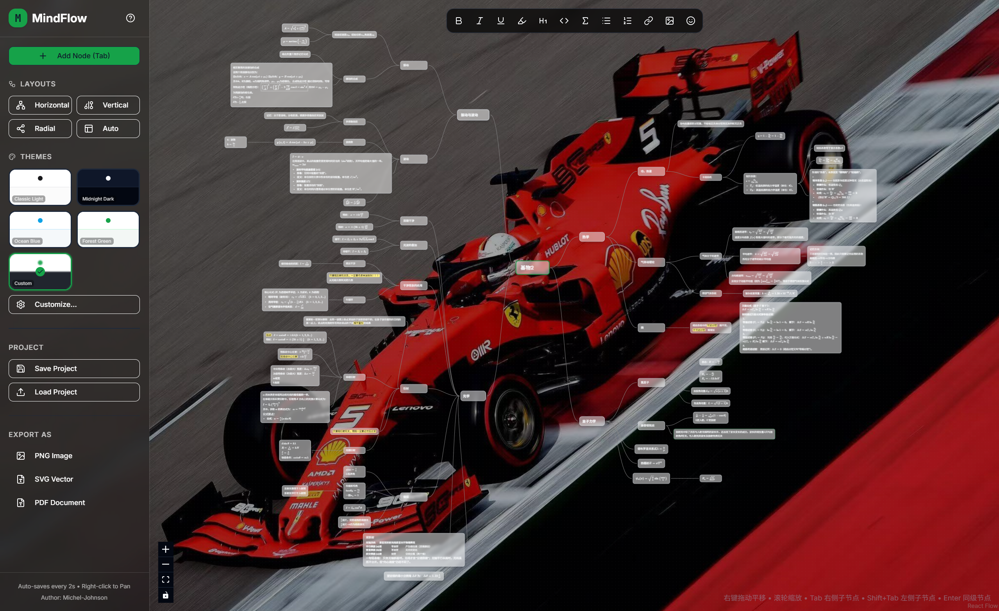

# MindFlow
🧐MindFlow 是一款专业的、支持 Markdown 的思维导图工具，适用于创意思考和项目规划。该应用提供了一个交互式画布，用户可以在可视化的思维导图中创建、编辑和组织节点。主要功能包括：

- 基于 React Flow 的交互式节点画布🤓
- 完整支持 Markdown，支持数学公式渲染（KaTeX）（这是我创建这个项目的根本原因）😍
- 多种主题选项（浅色、深色、海洋、森林等），支持自定义⛵
- 导出功能（PNG、SVG、PDF、JSON）😊
- 使用 dagre 图算法实现自动布局✌️
- 节点支持 Emoji 表情🫡

## 使用教程
在程序中点击？，即可查看使用教程

## 丰富主题

可自定义

